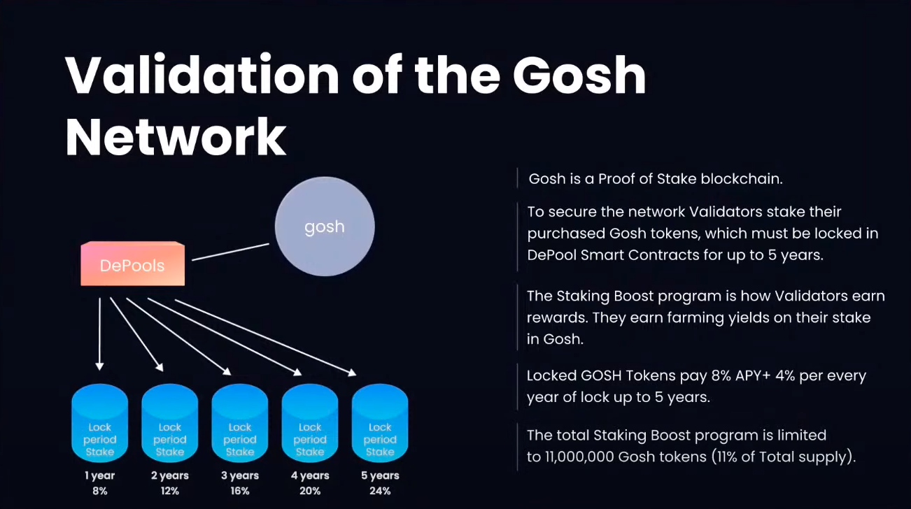
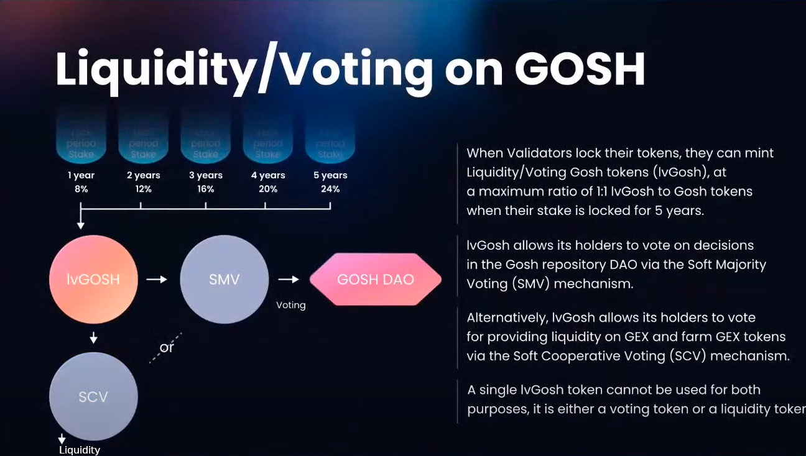
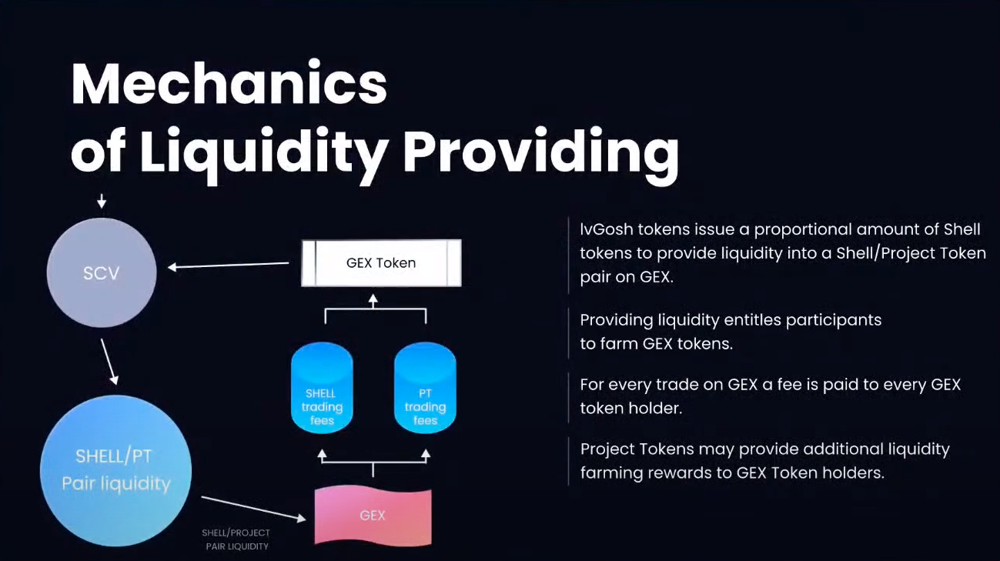
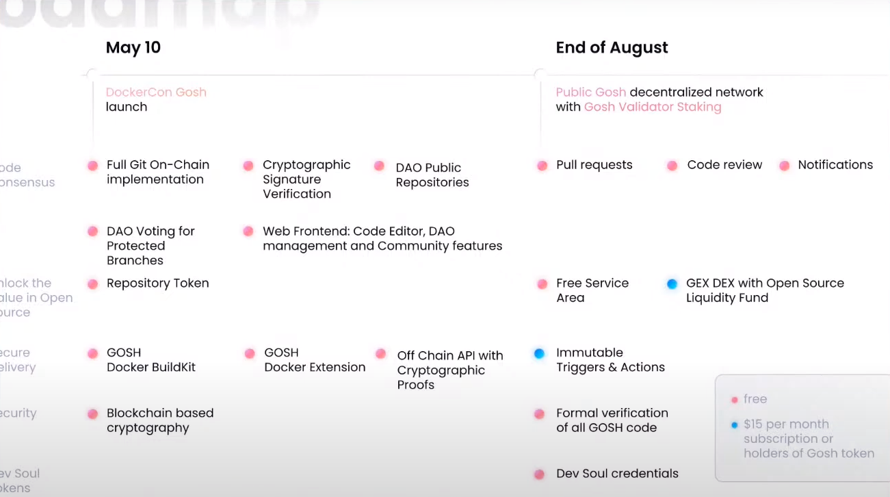

# KWPC presents `GOSH` EVERLOCK

Paulina: Hi everyone welcome to killer whale podcast my name is Paulina i have my colleague Jennifer here today with me. As you guys know on May 10th a DockerCon 2022 was presented uh `GOSH` blockchain - Git Open Source Holder a blockchain that is specially designed as a kit on chain, and we have today [Mitja Goroshevsky](https://www.linkedin.com/in/goroshevsky/) co-founder of gauche to talk about solutions `GOSH` is providing for securing the software supply chain and extracting the value of open source project. As you will see `GOSH` is much more than just a git hosting platform also today guys we're gonna have open chat where you can ask questions related to `GOSH` and at the end of the show we're gonna have i'm a session where me gonna answer your questions at the end of the episode.

Jennifer: So yes welcome again guys we are very sorry for technical issues at the beginning today we are hosting a one time only special event for members of everscale community today you can stake your evers and get locked `GOSH` tokens it's called Everlock a maximum total of 8 million evers can be locked in gauche blockchain in the pools for a period of to 1 up to 5 years. I will now guide you through the process. So you will see how to do it let me share my screen.

> TODO add image

So I will guide you promptly okay so first thing you need to go to the domain staking dot surf staking dot surf you will see as you can see here on the screen for those of you guys who don't have evers there will be two options for you install the wallet the first button second is deposit your evers buy exchange swap or transfer them by clicking on these links it will guide you through the whole process also we do have an open chart where you can write your questions, and we have served support team supporting us today they will answer your questions in the chat this is for those of you guys who don't have evers okay these two first blocks now starting the interesting part we have two `GOSH` pools as you can see here the general `GOSH` pool and validate `GOSH` the difference between these two is that the staking amount in the general pool is starting from 100 hours and validate `GOSH` starts from 100 000 ever. So if you want to validate `GOSH` proceed to validate `GOSH` pool okay let me show you how to state your address you just push the button right
you click stay covers here your amount is going to be uh you will see your amount here use take evers you decide how many months you see as month grow the percentage grows as well from eight percent up to 24 percent you decide the amount of evers you want to stick you push confirm guys it's a it's as easy as as it is. So please be mindful that here the minimum amount you can stake is 100 hours in the `GOSH` validate pool the minimum amount is 1 thousand one hundred thousand errors. So uh again if any questions please write them in the chat your questions will be answered.

Now uh let me come back to you guys okay just a second here. I'm again right now guys we are opening up the Everlock right now is officially open, and you can start taking your evers again if any questions more than welcome to write them in the chat we will now have Mitja covering up tokenomics of `GOSH` that is interesting for you, I understand it. So we have Mitja here with us by the way hi Mitja welcome to welcome!

Mitja: Hello, thank you.

Jennifer: Most of you guys obviously are familiar with Mitja. So meteo will know share with us the tokenomics media whenever you want you can start.

Mitja: Yeah let me share my screen and let me make it a little bigger and it starts from this slide.

> TODO add image https://youtu.be/d6Xgrkhnf8M?t=426

Mitja: So yeah um the part of the reasons why we couldn't launch uh `GOSH` on everscale blockchain is a very different economics in very different talking mechanics so in brief i will try to explain the difference um and you'll see that there are quite a lot of them. So the total supply of `GOSH` tokens 100 million um 11 millions of these tokens will be sold at a price of the three dollars um at pre-sale to private investors 11 million will go to idio at the price of ten dollars and then there will be a staking boost which we'll talk about later of 11 million tokens and 67 million targets will go to the ecosystem development and and the research and development of the ghost product itself now `GOSH` tokens obviously will be listed on `GOSH` decentralized exchange which called `GEX` and that is the internal gauche exchange you will see that uh it actually plays a crucial role in the whole in the whole construction.



Mitja: So in order to validate on the `GOSH` network use take you stake your gauche tokens right so um so you stake them for exactly like you do with everlog for up to five years yearly and uh then you have this apy per year it starts from eight percent and plus four percent every year yearly and that is the 11 million tokens um that we were talking about now the interesting part is that the validator of the `GOSH` network does not receive per block fees and they do not receive the transaction fees.



You only leave like the validator is paid by this apy for the for look now what you can once you locked your tokens you can do two things with them. So it's it's it doesn't end there you can take your `GOSH` tokens and you can use them in one or two um things one thing is that you can vote with them in the `GOSH` dao repository through the smv protocol and you can see how it works if you go to `GOSH` dot assassin start repository it will then launch a dao immediately and uh you can vote for example for a merchant of the main branch yeah you know and that's how work how how the how the voting works now
alternatively you can get a liquidity uh voting on `GOSH`. So you either you choose either to validate and then vote or to validate and then uh provide 
liquidity into the into the gags uh by the way when you vote um you have the propo it's uh the mechanism of the voting tokens is similar to the mechanism in curve where the the duration of your staking is um basically you get the voting tokens in relation to the duration of your staking. So maximum tokens if you stake hundred tokens the maximum voting tokens you get is for five if it's five years locked um if it's uh and then it goes proportionally down right. So um you get one-fifth of the votes if you if you stay for one year and of course to get the this hundred percent vote you will need to restate the tokens for you know for five years all the time.



Mitja: So you get the uh liquidity. So you have the other part you can either vote as we said or provide liquidity and you provide liquidity in the in the `GEX` um in the `GEX` exchange which is built in exchange inside the protocol and it's as you can see is tightly kind of coupled with the with the gauche document itself now maybe another important point and you see here like a little circle says `SHELL` project talk and pair liquidity um is that you stake these tokens in the liquidity pools which are `SHELL`. `SHELL` is a made main token on gauche main utility token on gauche which is a stable coin so you stake it into the stable coin pair with the project token and what you get in exchange for this staking is apart from the project token uh for providing this liquidity you get the `GEX` tokens as well. So basically when you get the `GEX` tokens you get the portion of all the fees in in in the exchange and uh and the project tokens that are that are that you provide liquidity for again it has some similarities to curve how careful but we take that to the extreme and basically say that if you are a validator then you stake the token for validation if you lock them for five years you get full amount of voting tokens then you can vote in the dow or revo or vote for liquidity and get all and then benefit from the liquidity provided for the whole ecosystem of the of the repositories that uh put the you know put the tokens on gex.



Mitja: So um i don't know if if you want me jenny to go over over the road map of the uh of `GOSH` a little bit here yeah because it it relates to tokenomics because yeah so so okay the important thing also about this tokenomics um is that we have something that one of the reasons we created it this way is that the tokens that you pay for gas but the gas doesn't go to validators the gas goes to something uh which called free service giver the free server service giver allows any project to to provide the access to their smart contracts for free um this is a revolutionary concept in the blockchain because you don't have a blockchain where you can you know you can execute smart contract for free on `GOSH` you can do that of course you have some limits to this execution and i'm not going to to explain how they work but in general if you follow certain guidelines you can apply your project and `GOSH` is itself like the giton chain itself is one of these projects that's how we're able to to actually provide a lot of `GOSH` repository services for free like exactly like github is doing today and the reason for this whole construction is that `GOSH` needs to compete with github gitlab and so on the developer wants to use `GOSH` exactly like they use github in order to do that we cannot charge for every commit like it doesn't work there's nobody will gonna do that um so instead with this construction we can provide free free tire service um where you can this free tire is exactly uh done exactly in the way like github is doing today so you can have an unlimited repositories you can have an unlimited um you know public repositories um unlimited dows pull requests code reviews notifications and so on and so forth you can have an also you can use the docker extension you can use the docker build kit you know with all the artifacts that that this process creates on `GOSH` now of course as github um is charging for some services the `GOSH` will also charge for some services and if you do the project like that um on on `GOSH` like another project on `GOSH` which also provide free services then you can also charge for some of that obviously so for example immutable triggers and actions and uh you know liquidity funds is coming with a charge there's also some other things that that goes like private reports and so on so you pay a money in but you don't need to pay for gas you can pay just subscription fees and one last thing it can actually do is you can just collect credit card payments without KYCML and this is also very important for traditional projects who just want some some monetization for what they're doing but they they don't care if it's in blockchain or not on blockchain of course they do care because they blockchain provides them with security guarantees and so on but for their end user it's not not necessarily they they don't need they don't want to kind of say to their burden their their customers with you know knowledge of a blockchain start paying gas and all these things well using the free area service on `GOSH` using basically a restricted `SHELL` the restricted portion of tokens you can just collect payments like you would do because in that respect this this tokens are untransferable in this free service area no no `SHELL` tokens are transferable and therefore they can only be transferred between the utility smart contracts therefore they just unit of account uh so it it fully complained um i think with this design we we're doing something that facebook tried to do and failed um we can actually execute that and we don't need to ask regulators because it's with this design is uh is totally compliant well again this is a very briefly like overview of uh of the tokenomics thanks.


Jennifer: Thank you.

Paulina: Thank you michael okay. So I have a couple of even more couple questions to you related to `GOSH` obviously so the first one. Is why only now why wasn't it possible to build a github on chain before can you tell us something about this?

Mitja: Yeah sure, well very simple there is no blockchain that can handle uh git like um today on take linux repository there is 80 million objects in linux repository you cannot put 80 million objects on any blockchain in a meaningful time or at all the only blockchain architecture that can do that is ever scale but also not in the current implementation um of the other scale even everscale cannot cannot do that therefore. We had to take the everscale because this is the only architecture which in general can support that and then tweak it to so that it can actually do this also i need to say in that regard the the requirement for for a validator on uh `GOSH` network is pretty high you need to have uh one terabyte of ram in your machine which is which costs around 600 euros per month in the something like that in this range right now so of course if you if you think about okay but what how how decentralizes that normal people cannot run the validate or something like that so i can i can answer that question already because it's part of this answer um.

So they say so they say okay i don't know where is the limit of course if you have five dollar you pay five or five dollars per server or more or less everyone can do that right um if you pay hundreds everyone can do that or not 200 where is the limit what you can do what i think you need to think from the perspective of the like it's a validator is a business you you invest some money and it's long being a business it's a business in any blockchain it's a business in uh in the bitcoin you invest some money and then you get some money in return right. So first of all like i don't know anyone who is who is putting now validator or minor under the table like it was you know 10 years ago it doesn't happen anymore uh and now think about this from the standpoint of what is the requirement for the to running a github like if you would run a github today as a cloud provider what would be the cost for infrastructure it would be huge so why it would be any different why people expect to be different so yeah if you want to be part of that if you want to support the network just call your data center you know buy a machine of 500 600 euros and of course you will gain money running that but also you will support support this this application which cannot be done differently.

Paulina: Right correct great meter the Second question is how does git on chain work people are curious?

Mitja: Yeah I won't be able to tell it in like three seconds here well you can say like the bullet points like how you like yeah first of all it works exactly like from the okay so let's say from the stand from the end user standpoint it works exactly like like a git like a normal git cloud like github okay you're taking like gauche remote configure it with your uh with your github hub client and whatever it is get client sorry whatever it is and then you push and you push when you push you push the blockchain. So from the user standpoint it works exactly the same way internally how it works that's a way more different like difficult question also i don't think it's a time now to explain all this and we can have a technical call sometimes but yeah but for the user it really it really is that you just use it as a use github nothing change and you we also have a great web interface which which basically just github interface you can you can go uh it's [app.gosh.sh](https://app.gosh.sh) and uh and you just use it like use github there are of course some features missing but we will add that that's too important.

Paulina: Okay. People who are familiar with github they can easily yeah absolutely

Mitja: Yeah

Paulina: Okay. The next question is why did you decide to create gauche but i think you'll like uh mention it briefly in the first question well it's it's it's very simple um like `GOSH` but today git is not decentralized right because well when Linus Thoroughly created kit he thought it would be completely decentralized like every developer will have their own like git server or something and then you have a git client

554
00:23:28,240 --> 00:23:30,720
but it really took off once the really

555
00:23:30,720 --> 00:23:32,640
easy to use service was provided like

556
00:23:32,640 --> 00:23:33,760
github

557
00:23:33,760 --> 00:23:35,760
so people it was very very easy for

558
00:23:35,760 --> 00:23:37,440
people okay you have github.com you

559
00:23:37,440 --> 00:23:38,880
don't need to think about it running

560
00:23:38,880 --> 00:23:40,880
your own server and you have this great

561
00:23:40,880 --> 00:23:43,440
community features around them

562
00:23:43,440 --> 00:23:45,760
the problem with this is that and it's a

563
00:23:45,760 --> 00:23:47,760
great service github is a great service

564
00:23:47,760 --> 00:23:48,720
the problem with that it's not

565
00:23:48,720 --> 00:23:51,440
decentralized it belongs to microsoft

566
00:23:51,440 --> 00:23:53,200
so um

567
00:23:53,200 --> 00:23:56,000
your code belongs to microsoft today

568
00:23:56,000 --> 00:23:57,679
that is like

569
00:23:57,679 --> 00:24:00,320
even if you trust microsoft

570
00:24:00,320 --> 00:24:02,720
i mean there is a there is a level where

571
00:24:02,720 --> 00:24:04,640
you should not trust

572
00:24:04,640 --> 00:24:06,880
someone with everything and for people

573
00:24:06,880 --> 00:24:08,240
who code

574
00:24:08,240 --> 00:24:11,039
it's everything the code is everything

575
00:24:11,039 --> 00:24:12,320
right so

576
00:24:12,320 --> 00:24:14,559
you don't trust microsoft with your life

577
00:24:14,559 --> 00:24:16,240
i wouldn't

578
00:24:16,240 --> 00:24:17,600
yeah

579
00:24:17,600 --> 00:24:18,400
right

580
00:24:18,400 --> 00:24:20,799
um so it's not censorship resistant

581
00:24:20,799 --> 00:24:22,720
it's it's prone to attacks and it's not

582
00:24:22,720 --> 00:24:23,919
very secure

583
00:24:23,919 --> 00:24:25,200
it's not very secure because it's

584
00:24:25,200 --> 00:24:26,480
centralized

585
00:24:26,480 --> 00:24:27,679
and

586
00:24:27,679 --> 00:24:28,640
also

587
00:24:28,640 --> 00:24:29,440
the

588
00:24:29,440 --> 00:24:32,080
the last thing is that the gear is just

589
00:24:32,080 --> 00:24:33,440
one

590
00:24:33,440 --> 00:24:35,200
part of the

591
00:24:35,200 --> 00:24:37,120
of the software

592
00:24:37,120 --> 00:24:37,919
like

593
00:24:37,919 --> 00:24:40,080
the software world because when you do

594
00:24:40,080 --> 00:24:41,679
the software it's not only that you code

595
00:24:41,679 --> 00:24:44,400
you should also deliver it somewhere

596
00:24:44,400 --> 00:24:46,400
you you want to install it on some

597
00:24:46,400 --> 00:24:48,640
computer server whatever

598
00:24:48,640 --> 00:24:50,000
and that's called

599
00:24:50,000 --> 00:24:51,919
uh software supply chain

600
00:24:51,919 --> 00:24:54,320
it starts from git and then it goes to

601
00:24:54,320 --> 00:24:57,120
some docker container and and then it

602
00:24:57,120 --> 00:24:59,600
goes to some installation of the of the

603
00:24:59,600 --> 00:25:01,919
software and also on the git like you

604
00:25:01,919 --> 00:25:04,240
use not only your own code you use some

605
00:25:04,240 --> 00:25:07,520
other code which comes from someone else

606
00:25:07,520 --> 00:25:09,360
and all of that

607
00:25:09,360 --> 00:25:12,240
really is not secure today

608
00:25:12,240 --> 00:25:15,120
there are very limited solutions here

609
00:25:15,120 --> 00:25:18,400
and there like you can sign container or

610
00:25:18,400 --> 00:25:21,440
you can you know provide some scanning

611
00:25:21,440 --> 00:25:23,760
for for third-party repositories and

612
00:25:23,760 --> 00:25:25,520
things like that so there are some

613
00:25:25,520 --> 00:25:27,440
possible like people trying to solve

614
00:25:27,440 --> 00:25:28,640
these problems but they're trying to

615
00:25:28,640 --> 00:25:30,559
solve it in a very fragmented way

616
00:25:30,559 --> 00:25:33,360
they're kind of in a very just just

617
00:25:33,360 --> 00:25:35,120
pinpointing some solutions to to

618
00:25:35,120 --> 00:25:36,720
different places there is no

619
00:25:36,720 --> 00:25:39,600
comprehensive solution for all of it and

620
00:25:39,600 --> 00:25:41,840
i think blockchain is just because it

621
00:25:41,840 --> 00:25:45,120
has the cryptography uh built in it has

622
00:25:45,120 --> 00:25:47,120
the signatures built in it can build

623
00:25:47,120 --> 00:25:49,279
this level of

624
00:25:49,279 --> 00:25:50,720
community level

625
00:25:50,720 --> 00:25:52,960
uh on top of on top of the objects which

626
00:25:52,960 --> 00:25:54,799
you put on the blockchain as as we

627
00:25:54,799 --> 00:25:57,039
understand i mean as we can see it works

628
00:25:57,039 --> 00:25:58,960
with the smart contracts

629
00:25:58,960 --> 00:26:01,039
using this you can secure the whole

630
00:26:01,039 --> 00:26:03,520
chain up to the containers and so on so

631
00:26:03,520 --> 00:26:06,480
um that's two reasons really

632
00:26:06,480 --> 00:26:08,640
well obviously it makes a lot of sense

633
00:26:08,640 --> 00:26:09,520
so

634
00:26:09,520 --> 00:26:11,360
why you decide to start `GOSH` as a new

635
00:26:11,360 --> 00:26:13,200
blockchain instead of launching the on

636
00:26:13,200 --> 00:26:16,000
everscale which is the difference

637
00:26:16,000 --> 00:26:18,159
i i i answered that partly in the future

638
00:26:18,159 --> 00:26:21,600
yeah i know you mentioned that so maybe

639
00:26:21,600 --> 00:26:24,400
documents is very different um

640
00:26:24,400 --> 00:26:27,279
and in in order to marry that with

641
00:26:27,279 --> 00:26:29,760
everscale like every scale would need to

642
00:26:29,760 --> 00:26:31,840
like change the whole token of its model

643
00:26:31,840 --> 00:26:33,200
completely

644
00:26:33,200 --> 00:26:35,200
um like the

645
00:26:35,200 --> 00:26:37,760
tokenomics of `GOSH` has two tokens `SHELL`

646
00:26:37,760 --> 00:26:38,880
and `GOSH`

647
00:26:38,880 --> 00:26:40,880
and go while gauche is like value

648
00:26:40,880 --> 00:26:43,039
talking the the `SHELL` is is a stable

649
00:26:43,039 --> 00:26:45,679
coin which is what pays gas in never

650
00:26:45,679 --> 00:26:47,679
scale there's only one token ever which

651
00:26:47,679 --> 00:26:48,880
pays gas

652
00:26:48,880 --> 00:26:50,640
and um

653
00:26:50,640 --> 00:26:51,600
yeah

654
00:26:51,600 --> 00:26:53,600
in in order to kind of maybe in the

655
00:26:53,600 --> 00:26:56,159
future we will be able to construct a

656
00:26:56,159 --> 00:26:58,720
work chain or use gauche as a work chain

657
00:26:58,720 --> 00:27:01,120
but for that many design

658
00:27:01,120 --> 00:27:03,039
things need to change in every scale

659
00:27:03,039 --> 00:27:07,039
architecture as it is right now like um

660
00:27:07,039 --> 00:27:09,600
the the it should be allowed to pay gas

661
00:27:09,600 --> 00:27:11,200
on the on the work chain with different

662
00:27:11,200 --> 00:27:13,760
tokens for example and and and so on and

663
00:27:13,760 --> 00:27:16,320
so forth so yeah so so there's it's just

664
00:27:16,320 --> 00:27:18,640
technically not possible today

665
00:27:18,640 --> 00:27:20,640
right okay

666
00:27:20,640 --> 00:27:23,679
so um what are the main differences

667
00:27:23,679 --> 00:27:26,399
between gauche and the traditional git

668
00:27:26,399 --> 00:27:27,840
hosting platform like you mentioned

669
00:27:27,840 --> 00:27:30,960
security what else you can add on this

670
00:27:30,960 --> 00:27:33,120
no it's it's it's really centralization

671
00:27:33,120 --> 00:27:34,720
is the central point like what is the

672
00:27:34,720 --> 00:27:36,320
difference between the money

673
00:27:36,320 --> 00:27:39,120
because it's like a dollar and bitcoin

674
00:27:39,120 --> 00:27:40,480
yeah well

675
00:27:40,480 --> 00:27:42,320
it's the centralization decentralization

676
00:27:42,320 --> 00:27:45,279
okay you name it which which gives us

677
00:27:45,279 --> 00:27:47,440
which gives the security right so

678
00:27:47,440 --> 00:27:49,679
decentralization is just just the start

679
00:27:49,679 --> 00:27:50,320
and

680
00:27:50,320 --> 00:27:52,080
on top of the discipline this is the

681
00:27:52,080 --> 00:27:55,279
main thing right okay

682
00:27:55,279 --> 00:27:58,000
so do companies and developers who are

683
00:27:58,000 --> 00:28:00,080
using the transition the traditional git

684
00:28:00,080 --> 00:28:02,159
need to adopt a new way of thinking or a

685
00:28:02,159 --> 00:28:05,200
new way of working when they use `GOSH`

686
00:28:05,200 --> 00:28:06,480
no they don't

687
00:28:06,480 --> 00:28:08,399
they can use `GOSH` like they use git

688
00:28:08,399 --> 00:28:09,600
today

689
00:28:09,600 --> 00:28:12,399
um the of course they do need

690
00:28:12,399 --> 00:28:14,720
then to think further what they can do

691
00:28:14,720 --> 00:28:16,480
with `GOSH` in terms of security because

692
00:28:16,480 --> 00:28:18,480
right now on github it doesn't it just

693
00:28:18,480 --> 00:28:20,799
not doesn't exist again

694
00:28:20,799 --> 00:28:21,600
he

695
00:28:21,600 --> 00:28:24,159
almost doesn't exist you almost

696
00:28:24,159 --> 00:28:26,480
don't have security comprehensive like

697
00:28:26,480 --> 00:28:28,159
security features to supply your

698
00:28:28,159 --> 00:28:29,600
software supply chain

699
00:28:29,600 --> 00:28:31,919
um in `GOSH` you can have it

700
00:28:31,919 --> 00:28:34,159
um you can get you can you can create

701
00:28:34,159 --> 00:28:36,880
all sorts of tools on top of your code

702
00:28:36,880 --> 00:28:38,960
on top of the you consensus of your code

703
00:28:38,960 --> 00:28:41,760
and then and then other tools so yeah

704
00:28:41,760 --> 00:28:44,399
they they will need to adapt to that but

705
00:28:44,399 --> 00:28:46,000
if they don't want to use it for some

706
00:28:46,000 --> 00:28:49,200
reason they can use it just like

707
00:28:49,200 --> 00:28:51,600
okay yeah great we will get to the

708
00:28:51,600 --> 00:28:53,279
security

709
00:28:53,279 --> 00:28:55,760
thank you thank you michael and

710
00:28:55,760 --> 00:28:59,279
now we have andrew from provendo

711
00:28:59,279 --> 00:29:01,440
uh he will discuss how gauche achieves

712
00:29:01,440 --> 00:29:03,520
security we

713
00:29:03,520 --> 00:29:06,240
okay jenny

714
00:29:06,240 --> 00:29:10,960
uh yes uh hi and hi

715
00:29:10,960 --> 00:29:12,799
thank you thank you for joining us today

716
00:29:12,799 --> 00:29:15,840
andrew is the co-founder of provenda

717
00:29:15,840 --> 00:29:18,480
and also a part of `GOSH` as formal

718
00:29:18,480 --> 00:29:21,279
verification is a huge part on `GOSH` so

719
00:29:21,279 --> 00:29:22,480
amber

720
00:29:22,480 --> 00:29:24,880
is here with us today to discuss uh

721
00:29:24,880 --> 00:29:27,039
security on `GOSH` but the first question

722
00:29:27,039 --> 00:29:29,679
we wanted to ask you andre is

723
00:29:29,679 --> 00:29:32,559
what security challenges do git hosting

724
00:29:32,559 --> 00:29:36,720
platforms face today in your opinion

725
00:29:36,720 --> 00:29:37,760
yeah

726
00:29:37,760 --> 00:29:40,240
thank you very much for inviting me here

727
00:29:40,240 --> 00:29:42,640
so uh mostly meter

728
00:29:42,640 --> 00:29:44,880
i'll answer these questions but i would

729
00:29:44,880 --> 00:29:46,399
like to add something

730
00:29:46,399 --> 00:29:49,200
yeah actually i i see i see two big

731
00:29:49,200 --> 00:29:52,480
issues here in in centralized platforms

732
00:29:52,480 --> 00:29:54,640
uh first of all if the

733
00:29:54,640 --> 00:29:56,720
the that the user

734
00:29:56,720 --> 00:29:59,120
having their pulse code from for example

735
00:29:59,120 --> 00:30:01,200
from any centralized git git based

736
00:30:01,200 --> 00:30:05,919
platform uh has no any uh way to uh to

737
00:30:05,919 --> 00:30:09,360
verify how the code works actually so

738
00:30:09,360 --> 00:30:13,360
there is no uh any any indication of the

739
00:30:13,360 --> 00:30:14,799
correspondence of the code and

740
00:30:14,799 --> 00:30:16,960
specification so you just you just can

741
00:30:16,960 --> 00:30:19,440
pull the code and try at your own risk

742
00:30:19,440 --> 00:30:21,760
what what is what's going on so that

743
00:30:21,760 --> 00:30:24,480
that the main points of uh involving the

744
00:30:24,480 --> 00:30:26,159
formal amplification

745
00:30:26,159 --> 00:30:29,279
and the second thing uh i would like to

746
00:30:29,279 --> 00:30:32,240
to add is the

747
00:30:32,360 --> 00:30:34,799
decentralization so uh if you have

748
00:30:34,799 --> 00:30:36,960
centralized platform you cannot

749
00:30:36,960 --> 00:30:39,760
guarantee the availability of all your

750
00:30:39,760 --> 00:30:42,320
code to be to be always you can be

751
00:30:42,320 --> 00:30:44,799
interrupted by internal internal

752
00:30:44,799 --> 00:30:49,039
decisions of uh platform holders and

753
00:30:49,039 --> 00:30:52,399
and there is no way to mitigate that so

754
00:30:52,399 --> 00:30:55,600
the scripts based on the fact of their

755
00:30:55,600 --> 00:30:59,279
availability of some repository uh can

756
00:30:59,279 --> 00:31:00,640
suddenly

757
00:31:00,640 --> 00:31:03,919
uh interrupted or crashed because the

758
00:31:03,919 --> 00:31:06,480
host blocked the repository and that's a

759
00:31:06,480 --> 00:31:09,360
big issue in the free software world

760
00:31:09,360 --> 00:31:12,080
where we i hope we are living in

761
00:31:12,080 --> 00:31:16,000
uh so to mitigate the first uh

762
00:31:16,000 --> 00:31:17,519
mitigate the first

763
00:31:17,519 --> 00:31:19,440
issue i think that

764
00:31:19,440 --> 00:31:21,600
there are many many many many things

765
00:31:21,600 --> 00:31:24,000
that can be involved for example you can

766
00:31:24,000 --> 00:31:26,080
you can have naming branch

767
00:31:26,080 --> 00:31:28,640
uh in your repository where you can

768
00:31:28,640 --> 00:31:29,760
indicate

769
00:31:29,760 --> 00:31:33,120
your vision of how the cotton side works

770
00:31:33,120 --> 00:31:35,120
for example you can name it like like

771
00:31:35,120 --> 00:31:37,200
you know stable and stable tasting and

772
00:31:37,200 --> 00:31:40,880
so on but there is no any formal way to

773
00:31:40,880 --> 00:31:42,799
verify that the cotton site is

774
00:31:42,799 --> 00:31:44,399
definitely stable

775
00:31:44,399 --> 00:31:46,480
that is not any formal way you can you

776
00:31:46,480 --> 00:31:48,880
can just believe developers that that

777
00:31:48,880 --> 00:31:50,799
they think like this

778
00:31:50,799 --> 00:31:53,039
uh you can you can put you can put the

779
00:31:53,039 --> 00:31:55,600
test inside and

780
00:31:55,600 --> 00:31:59,039
you can verify the functionality of the

781
00:31:59,039 --> 00:32:01,519
of the court uh

782
00:32:01,519 --> 00:32:03,840
running the tests by the tests are also

783
00:32:03,840 --> 00:32:05,760
the part of developer's vision and there

784
00:32:05,760 --> 00:32:08,720
is no any external external assessment

785
00:32:08,720 --> 00:32:10,960
of how the curtain side works

786
00:32:10,960 --> 00:32:15,600
so uh uh yeah i think i see that

787
00:32:15,600 --> 00:32:17,039
that's that's very interesting yes and

788
00:32:17,039 --> 00:32:19,039
that's strange that it's still working

789
00:32:19,039 --> 00:32:20,240
like this so

790
00:32:20,240 --> 00:32:22,480
uh how `GOSH` is going to be different can

791
00:32:22,480 --> 00:32:25,360
you tell us the vision of `GOSH` security

792
00:32:25,360 --> 00:32:26,240
yeah

793
00:32:26,240 --> 00:32:30,159
so i'm going to talk about the vision uh

794
00:32:30,159 --> 00:32:32,880
so so we we plan to have gauche formula

795
00:32:32,880 --> 00:32:35,360
verify itself so it's very very

796
00:32:35,360 --> 00:32:37,600
important thing that we have

797
00:32:37,600 --> 00:32:40,799
the core system uh to be formally

798
00:32:40,799 --> 00:32:44,320
verified where everybody can

799
00:32:44,320 --> 00:32:46,320
can accept the information of how this

800
00:32:46,320 --> 00:32:48,799
works and what is the specification the

801
00:32:48,799 --> 00:32:51,519
second thing is that we would like to

802
00:32:51,519 --> 00:32:53,919
to add the formal indication for every

803
00:32:53,919 --> 00:32:56,640
repository of the status of its

804
00:32:56,640 --> 00:32:59,200
formal verification so you can see

805
00:32:59,200 --> 00:33:02,960
not not just verbose but just formal

806
00:33:02,960 --> 00:33:04,559
indication that

807
00:33:04,559 --> 00:33:06,799
the status of this repository is

808
00:33:06,799 --> 00:33:08,559
formally verified or not

809
00:33:08,559 --> 00:33:11,279
and you can see inside and have the

810
00:33:11,279 --> 00:33:14,799
specification and you can get the full

811
00:33:14,799 --> 00:33:17,919
knowledge of what specification is

812
00:33:17,919 --> 00:33:21,120
proposed and how it is verified

813
00:33:21,120 --> 00:33:24,399
uh so this is about formulification so

814
00:33:24,399 --> 00:33:25,519
another thing

815
00:33:25,519 --> 00:33:27,679
yeah another thing is that `GOSH` is of

816
00:33:27,679 --> 00:33:30,720
course decentralized so no intervention

817
00:33:30,720 --> 00:33:33,279
no blocks and your scripts uh are

818
00:33:33,279 --> 00:33:36,320
supposed to to work as intended

819
00:33:36,320 --> 00:33:37,519
uh

820
00:33:37,519 --> 00:33:42,960
so and to help user to to have uh the

821
00:33:42,960 --> 00:33:44,480
repositories

822
00:33:44,480 --> 00:33:45,440
uh to

823
00:33:45,440 --> 00:33:48,320
comply to formal verification we we

824
00:33:48,320 --> 00:33:50,240
would like to provide the

825
00:33:50,240 --> 00:33:52,880
the very strong verification environment

826
00:33:52,880 --> 00:33:55,519
which will highly decrease the cost of

827
00:33:55,519 --> 00:33:58,559
the plant verification so there there is

828
00:33:58,559 --> 00:34:01,679
no that the user will be not alone in

829
00:34:01,679 --> 00:34:04,840
this very mathematical space

830
00:34:04,840 --> 00:34:06,559
yeah

831
00:34:06,559 --> 00:34:09,760
right so yeah basically so it can people

832
00:34:09,760 --> 00:34:11,839
will be able to divide also costs right

833
00:34:11,839 --> 00:34:14,719
if i if i um yeah correctly yeah so

834
00:34:14,719 --> 00:34:17,679
inside this uh instead this we put the

835
00:34:17,679 --> 00:34:21,599
dell mechanism so having dao you can you

836
00:34:21,599 --> 00:34:24,239
can divide the costs of uh

837
00:34:24,239 --> 00:34:26,399
of formal verification for a code so

838
00:34:26,399 --> 00:34:29,199
everyone everyone needs to to use the

839
00:34:29,199 --> 00:34:32,719
proper software and users can divide

840
00:34:32,719 --> 00:34:36,639
costs to to to have their most like

841
00:34:36,639 --> 00:34:39,440
most usable repositories to be formally

842
00:34:39,440 --> 00:34:40,800
verified

843
00:34:40,800 --> 00:34:43,199
great that's very interesting yes i

844
00:34:43,199 --> 00:34:45,440
think that's a huge step forward to be

845
00:34:45,440 --> 00:34:48,480
honest understanding this process is

846
00:34:48,480 --> 00:34:51,760
uh not the the most easy thing but once

847
00:34:51,760 --> 00:34:54,159
you get to it i think it's amazing so

848
00:34:54,159 --> 00:34:55,520
good luck with that

849
00:34:55,520 --> 00:34:57,839
uh thank you andre for joining us thank

850
00:34:57,839 --> 00:35:00,480
you again thank you thank you thank you

851
00:35:00,480 --> 00:35:02,560
so

852
00:35:02,560 --> 00:35:05,040
malina all right next

853
00:35:05,040 --> 00:35:08,800
all righty guys so now we have

854
00:35:08,800 --> 00:35:11,520
questions we have our amma session with

855
00:35:11,520 --> 00:35:14,000
questions that you came up with and

856
00:35:14,000 --> 00:35:16,079
haven't been answered already during

857
00:35:16,079 --> 00:35:17,839
this translation

858
00:35:17,839 --> 00:35:20,800
so the first question is

859
00:35:20,800 --> 00:35:22,400
to meet of course

860
00:35:22,400 --> 00:35:24,640
please tell us about your revenue model

861
00:35:24,640 --> 00:35:26,240
will this model be economically

862
00:35:26,240 --> 00:35:28,480
sustainable

863
00:35:28,480 --> 00:35:31,359
well yeah i tried before

864
00:35:31,359 --> 00:35:34,960
but i hope it will be because um

865
00:35:34,960 --> 00:35:37,440
like it i think that's the right uh

866
00:35:37,440 --> 00:35:40,160
balances um in the in this talk

867
00:35:40,160 --> 00:35:41,280
economics

868
00:35:41,280 --> 00:35:43,599
first of all like `GOSH` is a capture

869
00:35:43,599 --> 00:35:44,960
value capture talk and it's very

870
00:35:44,960 --> 00:35:46,640
important for the open source industry

871
00:35:46,640 --> 00:35:49,200
that the the talking of like the main

872
00:35:49,200 --> 00:35:51,760
token for the repositories

873
00:35:51,760 --> 00:35:55,359
um will be capturing value and i think

874
00:35:55,359 --> 00:35:57,680
it's capturing in terms of design it's

875
00:35:57,680 --> 00:36:00,320
supposed to capture value more than than

876
00:36:00,320 --> 00:36:02,800
a bitcoin well because bitcoin

877
00:36:02,800 --> 00:36:05,200
has like or ethereum because like they

878
00:36:05,200 --> 00:36:07,200
have an emission

879
00:36:07,200 --> 00:36:09,760
which is still ongoing in

880
00:36:09,760 --> 00:36:12,240
in `GOSH` the emission will just stop

881
00:36:12,240 --> 00:36:15,200
completely after five years

882
00:36:15,200 --> 00:36:17,440
unless um

883
00:36:17,440 --> 00:36:21,280
like unless the dao will decide that

884
00:36:21,280 --> 00:36:24,480
um and vote for that some portion of gas

885
00:36:24,480 --> 00:36:26,400
should be directed to validators this is

886
00:36:26,400 --> 00:36:28,640
possible but still it's not a new

887
00:36:28,640 --> 00:36:31,040
emission it's just it's just it's just a

888
00:36:31,040 --> 00:36:32,800
gas pain and some gas payments are in

889
00:36:32,800 --> 00:36:34,400
all in `SHELL` talking so it's a stable

890
00:36:34,400 --> 00:36:36,320
coin it's not gauche so it won't affect

891
00:36:36,320 --> 00:36:37,599
gauche token

892
00:36:37,599 --> 00:36:39,280
so um

893
00:36:39,280 --> 00:36:42,480
okay and the another thing is uh the

894
00:36:42,480 --> 00:36:45,440
pricing and i saw some in the chat

895
00:36:45,440 --> 00:36:48,240
um i think uh someone asked about the

896
00:36:48,240 --> 00:36:50,800
sustainability of the 15 because that we

897
00:36:50,800 --> 00:36:53,359
we think we need to charge like 15

898
00:36:53,359 --> 00:36:54,400
per month

899
00:36:54,400 --> 00:36:55,200
um

900
00:36:55,200 --> 00:36:57,040
first of all i have to say that first of

901
00:36:57,040 --> 00:36:58,400
all

902
00:36:58,400 --> 00:37:00,880
when we charge 15 we charge one power

903
00:37:00,880 --> 00:37:03,359
with actually we provide more for free

904
00:37:03,359 --> 00:37:05,760
almost more for free than than the

905
00:37:05,760 --> 00:37:07,119
github

906
00:37:07,119 --> 00:37:08,880
and the 15

907
00:37:08,880 --> 00:37:10,800
apply for people who want to already

908
00:37:10,800 --> 00:37:13,200
it's like advanced security features

909
00:37:13,200 --> 00:37:15,599
now in who is

910
00:37:15,599 --> 00:37:17,280
who would buy this advanced security

911
00:37:17,280 --> 00:37:19,599
features it not it's not just just the

912
00:37:19,599 --> 00:37:20,960
developers you know

913
00:37:20,960 --> 00:37:23,119
you know startups or anything like that

914
00:37:23,119 --> 00:37:25,920
like the startups can use ```GOSH``` for free

915
00:37:25,920 --> 00:37:27,920
they could do like github this advanced

916
00:37:27,920 --> 00:37:29,440
security features they mostly need for

917
00:37:29,440 --> 00:37:32,320
corporations and corporations like i

918
00:37:32,320 --> 00:37:34,560
think they what github or gitlab is

919
00:37:34,560 --> 00:37:35,760
charging

920
00:37:35,760 --> 00:37:37,839
is i think the sweet spot where

921
00:37:37,839 --> 00:37:39,520
corporations already what corporations

922
00:37:39,520 --> 00:37:41,520
are ready to pay and i think there is no

923
00:37:41,520 --> 00:37:43,440
problem right now to pay 15 for

924
00:37:43,440 --> 00:37:45,280
developer for one of the most important

925
00:37:45,280 --> 00:37:48,400
security tools you have to remember that

926
00:37:48,400 --> 00:37:51,280
on average the corporations today spend

927
00:37:51,280 --> 00:37:54,320
to 30 percent of their security budget

928
00:37:54,320 --> 00:37:56,320
on um

929
00:37:56,320 --> 00:37:58,000
sorry of you of their i.t budget on

930
00:37:58,000 --> 00:37:59,280
security

931
00:37:59,280 --> 00:38:01,359
it's a it's a huge amount of money so

932
00:38:01,359 --> 00:38:03,119
it's not about paying for github

933
00:38:03,119 --> 00:38:04,960
developer for github despite the fact

934
00:38:04,960 --> 00:38:07,760
that even that is not that high like 15

935
00:38:07,760 --> 00:38:09,359
it's it's pay for the security so it can

936
00:38:09,359 --> 00:38:11,119
go up from the security budget which

937
00:38:11,119 --> 00:38:12,640
which is huge so i don't think there is

938
00:38:12,640 --> 00:38:14,720
a problem with 15

939
00:38:14,720 --> 00:38:17,440
50 per month

940
00:38:17,440 --> 00:38:19,520
i do see that some questions we do have

941
00:38:19,520 --> 00:38:20,800
here

942
00:38:20,800 --> 00:38:22,400
we do have here some questions that were

943
00:38:22,400 --> 00:38:24,400
already covered for example why should

944
00:38:24,400 --> 00:38:26,720
programmers choose ```GOSH``` how will you

945
00:38:26,720 --> 00:38:28,720
sell it or

946
00:38:28,720 --> 00:38:29,760
would you

947
00:38:29,760 --> 00:38:31,440
comment could you add something maybe

948
00:38:31,440 --> 00:38:34,320
more yeah for selling yourself

949
00:38:34,320 --> 00:38:36,079
yeah how will you sell it why should

950
00:38:36,079 --> 00:38:37,920
programmers choose ```GOSH``` how will you

951
00:38:37,920 --> 00:38:38,880
sell it

952
00:38:38,880 --> 00:38:40,480
no pro it's a different question why

953
00:38:40,480 --> 00:38:42,240
should programmers choose ```GOSH``` it's it's

954
00:38:42,240 --> 00:38:44,160
for decentralization and everything that

955
00:38:44,160 --> 00:38:47,119
we covered before uh security and and

956
00:38:47,119 --> 00:38:49,040
decentralization and privacy and so on

957
00:38:49,040 --> 00:38:51,119
and so forth uh for

958
00:38:51,119 --> 00:38:54,720
for how and and for for consensus on top

959
00:38:54,720 --> 00:38:56,480
of the code and all of these things i

960
00:38:56,480 --> 00:38:58,079
think for for

961
00:38:58,079 --> 00:39:01,359
the how we're gonna sell it yeah well uh

962
00:39:01,359 --> 00:39:02,640
that's why

963
00:39:02,640 --> 00:39:04,640
we are approaching that from first of

964
00:39:04,640 --> 00:39:06,880
all from the um

965
00:39:06,880 --> 00:39:10,160
like security standpoint so

966
00:39:10,160 --> 00:39:12,839
in order to sell it to

967
00:39:12,839 --> 00:39:16,320
a companies call either projects well

968
00:39:16,320 --> 00:39:18,400
interested in security or mostly

969
00:39:18,400 --> 00:39:20,160
vulnerable projects we're going to

970
00:39:20,160 --> 00:39:22,560
partner with companies like docker for

971
00:39:22,560 --> 00:39:24,640
example like bit resource that would be

972
00:39:24,640 --> 00:39:27,119
what we're doing for space industry

973
00:39:27,119 --> 00:39:29,200
we're going to expand on that because it

974
00:39:29,200 --> 00:39:30,720
is a it is a

975
00:39:30,720 --> 00:39:32,640
like there are a lot of solutions that

976
00:39:32,640 --> 00:39:33,440
need

977
00:39:33,440 --> 00:39:35,440
um the security features which we

978
00:39:35,440 --> 00:39:37,680
provide mission critical

979
00:39:37,680 --> 00:39:40,240
yeah exactly so we're going to to work

980
00:39:40,240 --> 00:39:41,599
with partners and

981
00:39:41,599 --> 00:39:44,240
if you provide security solution for

982
00:39:44,240 --> 00:39:46,960
your i.t uh like

983
00:39:46,960 --> 00:39:47,839
you know

984
00:39:47,839 --> 00:39:50,480
customers you can use ```GOSH```

985
00:39:50,480 --> 00:39:52,960
yourselves we don't need to push that

986
00:39:52,960 --> 00:39:56,480
too much like if we find a partner um

987
00:39:56,480 --> 00:39:58,640
who who you know who need it they will

988
00:39:58,640 --> 00:40:00,640
distribute the software because it's

989
00:40:00,640 --> 00:40:02,240
again it's available for everyone they

990
00:40:02,240 --> 00:40:04,160
can make money off that why not why not

991
00:40:04,160 --> 00:40:06,240
to do that you can build a solution for

992
00:40:06,240 --> 00:40:07,760
your customer

993
00:40:07,760 --> 00:40:10,319
on the smart contracts you using ```GOSH```

994
00:40:10,319 --> 00:40:12,319
right and and then you can sell it to

995
00:40:12,319 --> 00:40:14,400
your customer and as i just explained

996
00:40:14,400 --> 00:40:15,839
before you can even sell it for the

997
00:40:15,839 --> 00:40:17,599
normal payment of the greater payment so

998
00:40:17,599 --> 00:40:19,200
you don't even need to they don't need

999
00:40:19,200 --> 00:40:20,800
to buy any cryptocurrency or anything

1000
00:40:20,800 --> 00:40:24,160
like that so it's really i think this is

1001
00:40:24,160 --> 00:40:27,359
uh like a unique solution which can be

1002
00:40:27,359 --> 00:40:29,920
distributed via normal i.t distribution

1003
00:40:29,920 --> 00:40:31,440
channels which again never happened

1004
00:40:31,440 --> 00:40:34,160
before with blockchain solutions ever

1005
00:40:34,160 --> 00:40:36,079
so you can take ```GOSH``` as a platform and

1006
00:40:36,079 --> 00:40:37,839
you can distribute it through the just

1007
00:40:37,839 --> 00:40:40,640
normal normal at distribution channels

1008
00:40:40,640 --> 00:40:42,160
with partnership you can you can build

1009
00:40:42,160 --> 00:40:44,480
on top of that as as an integrator or

1010
00:40:44,480 --> 00:40:46,960
anything like that right so i think this

1011
00:40:46,960 --> 00:40:48,560
this is how we're going to sell it

1012
00:40:48,560 --> 00:40:49,920
through it's not we're going to sell

1013
00:40:49,920 --> 00:40:51,520
you're going to sell it

1014
00:40:51,520 --> 00:40:52,400
and

1015
00:40:52,400 --> 00:40:53,359
and

1016
00:40:53,359 --> 00:40:54,400
and then

1017
00:40:54,400 --> 00:40:56,319
the other other customer like not

1018
00:40:56,319 --> 00:40:58,319
customer but partners

1019
00:40:58,319 --> 00:41:00,640
we think of course is is is the

1020
00:41:00,640 --> 00:41:01,920
blockchain community and any

1021
00:41:01,920 --> 00:41:03,520
decentralized project and they think for

1022
00:41:03,520 --> 00:41:05,520
decentralized projects it's a no-brainer

1023
00:41:05,520 --> 00:41:07,680
because you if you are a decentralized

1024
00:41:07,680 --> 00:41:09,280
project and your code is on the

1025
00:41:09,280 --> 00:41:11,920
centralized platform it's an absolute

1026
00:41:11,920 --> 00:41:13,119
right

1027
00:41:13,119 --> 00:41:15,119
when ```GOSH``` will be like everyone will

1028
00:41:15,119 --> 00:41:16,640
know gaussian that will work great and

1029
00:41:16,640 --> 00:41:18,400
so on and so forth there will be simply

1030
00:41:18,400 --> 00:41:20,480
no explanation you will not explain to

1031
00:41:20,480 --> 00:41:22,480
your users like you today you cannot

1032
00:41:22,480 --> 00:41:24,880
explain to your users why you have keys

1033
00:41:24,880 --> 00:41:27,119
of your smart contracts for example why

1034
00:41:27,119 --> 00:41:28,720
your solution is not decentralized on

1035
00:41:28,720 --> 00:41:30,880
blockchain every user will ask you wait

1036
00:41:30,880 --> 00:41:32,640
you hold the key

1037
00:41:32,640 --> 00:41:34,960
why it's not decentralized uh exactly

1038
00:41:34,960 --> 00:41:36,640
the same thing will happen where where

1039
00:41:36,640 --> 00:41:38,079
they will ask they will start asking

1040
00:41:38,079 --> 00:41:40,560
where is your code why it's not in cash

1041
00:41:40,560 --> 00:41:41,760
right

1042
00:41:41,760 --> 00:41:44,480
right exactly yeah

1043
00:41:44,480 --> 00:41:46,400
yes

1044
00:41:46,400 --> 00:41:48,400
right very interesting by the way yup

1045
00:41:48,400 --> 00:41:51,200
yeah uh paulina you want to go with next

1046
00:41:51,200 --> 00:41:55,119
question next question how `GOSH` tokens

1047
00:41:55,119 --> 00:41:57,680
be used

1048
00:41:57,680 --> 00:41:59,200
how can i think it's a part of

1049
00:41:59,200 --> 00:42:02,319
tokenomics also yeah yeah yeah i mean

1050
00:42:02,319 --> 00:42:04,960
you have a direct use of `GOSH` talking so

1051
00:42:04,960 --> 00:42:07,119
uh goshtoken is a voting token on gauche

1052
00:42:07,119 --> 00:42:09,119
repository so obviously developer will

1053
00:42:09,119 --> 00:42:10,960
use developers of the `GOSH` itself they

1054
00:42:10,960 --> 00:42:13,839
will use it um to regulate the network

1055
00:42:13,839 --> 00:42:16,880
and if you are a stakeholder if you vote

1056
00:42:16,880 --> 00:42:19,839
or invested into `GOSH` um your validate

1057
00:42:19,839 --> 00:42:21,839
or something you may want to

1058
00:42:21,839 --> 00:42:24,400
uh to influence decisions and you can

1059
00:42:24,400 --> 00:42:26,240
use your staked `GOSH` to influence

1060
00:42:26,240 --> 00:42:28,880
decisions of the dao repository right go

1061
00:42:28,880 --> 00:42:32,640
and vote there and another is that

1062
00:42:32,640 --> 00:42:34,640
obviously you if you stake your tokens

1063
00:42:34,640 --> 00:42:36,560
then you can you can provide liquidity

1064
00:42:36,560 --> 00:42:38,079
when you provide liquidity you support

1065
00:42:38,079 --> 00:42:39,359
the open source

1066
00:42:39,359 --> 00:42:42,000
uh movement you support the basically

1067
00:42:42,000 --> 00:42:44,000
the whole open source community because

1068
00:42:44,000 --> 00:42:46,880
we hope that the open source community

1069
00:42:46,880 --> 00:42:48,480
again because of this decentralized

1070
00:42:48,480 --> 00:42:50,319
features maybe that's important also

1071
00:42:50,319 --> 00:42:51,839
point to mention like how the open

1072
00:42:51,839 --> 00:42:55,200
source projects are managed right now

1073
00:42:55,200 --> 00:42:58,400
they either manage just by people know

1074
00:42:58,400 --> 00:43:00,560
each other

1075
00:43:00,560 --> 00:43:01,760
basically

1076
00:43:01,760 --> 00:43:03,599
right because like it's on the it's on

1077
00:43:03,599 --> 00:43:05,920
the github and the github

1078
00:43:05,920 --> 00:43:08,560
in github you have a repository owner

1079
00:43:08,560 --> 00:43:10,000
that single person who owns the

1080
00:43:10,000 --> 00:43:12,800
repository so like why you trust this

1081
00:43:12,800 --> 00:43:13,760
person

1082
00:43:13,760 --> 00:43:15,200
because this person person can do

1083
00:43:15,200 --> 00:43:17,440
whatever they want he wants like he or

1084
00:43:17,440 --> 00:43:21,280
she like she can they can just just uh

1085
00:43:21,280 --> 00:43:23,119
disallow you to access to this

1086
00:43:23,119 --> 00:43:25,839
repository if they don't like you right

1087
00:43:25,839 --> 00:43:28,319
or or uh they can delete the code or can

1088
00:43:28,319 --> 00:43:29,920
install malicious code or whatever they

1089
00:43:29,920 --> 00:43:31,920
want right so

1090
00:43:31,920 --> 00:43:34,720
it's it's a kind of some sort of trust

1091
00:43:34,720 --> 00:43:37,359
level on this and we see it doesn't work

1092
00:43:37,359 --> 00:43:40,319
very well because actually like the vast

1093
00:43:40,319 --> 00:43:42,319
majority of the open source repositories

1094
00:43:42,319 --> 00:43:45,040
are not maintained at all we have a huge

1095
00:43:45,040 --> 00:43:48,240
collection of garbage code let's face it

1096
00:43:48,240 --> 00:43:50,160
like the open source is great the open

1097
00:43:50,160 --> 00:43:52,960
source is is amazing we have a we have a

1098
00:43:52,960 --> 00:43:54,960
very useful code we have a code that

1099
00:43:54,960 --> 00:43:57,280
everyone uses but this is like ten

1100
00:43:57,280 --> 00:43:59,440
percent of the whole code

1101
00:43:59,440 --> 00:44:01,680
even less i think and the rest is

1102
00:44:01,680 --> 00:44:04,319
completely not non-used someone just did

1103
00:44:04,319 --> 00:44:06,960
it and it's it's been abandoned and no

1104
00:44:06,960 --> 00:44:09,040
community no community was created and

1105
00:44:09,040 --> 00:44:11,040
so on and so forth

1106
00:44:11,040 --> 00:44:13,119
uh `GOSH` gives this level

1107
00:44:13,119 --> 00:44:15,680
gives this level of the

1108
00:44:15,680 --> 00:44:17,599
building the community

1109
00:44:17,599 --> 00:44:19,839
without need for trust

1110
00:44:19,839 --> 00:44:20,960
so you

1111
00:44:20,960 --> 00:44:22,960
and that may

1112
00:44:22,960 --> 00:44:26,079
give open source developers easier path

1113
00:44:26,079 --> 00:44:27,680
to contribute to different repositories

1114
00:44:27,680 --> 00:44:30,000
because they know that nobody is in

1115
00:44:30,000 --> 00:44:31,599
control like there is no single party

1116
00:44:31,599 --> 00:44:33,680
who like or dislike or you know if you

1117
00:44:33,680 --> 00:44:35,920
want to be involved in this repository

1118
00:44:35,920 --> 00:44:37,920
you can gain tokens of this repository

1119
00:44:37,920 --> 00:44:39,200
and that will be enough you will be

1120
00:44:39,200 --> 00:44:40,560
influenced already it doesn't matter

1121
00:44:40,560 --> 00:44:42,240
what happens to the person who

1122
00:44:42,240 --> 00:44:44,079
maintained it or in the future and so on

1123
00:44:44,079 --> 00:44:46,079
so forth so that is very important

1124
00:44:46,079 --> 00:44:47,839
another thing is that the large

1125
00:44:47,839 --> 00:44:49,359
repositories large open source

1126
00:44:49,359 --> 00:44:51,760
requesters projects like linux

1127
00:44:51,760 --> 00:44:54,560
they manage by foundation

1128
00:44:54,560 --> 00:44:57,680
right usually like big big repositories

1129
00:44:57,680 --> 00:45:00,240
they either manage by some big company

1130
00:45:00,240 --> 00:45:03,119
which then makes it centralized right or

1131
00:45:03,119 --> 00:45:06,000
they are managed by this foundation but

1132
00:45:06,000 --> 00:45:07,440
there are like

1133
00:45:07,440 --> 00:45:09,680
very few foundations and their capacity

1134
00:45:09,680 --> 00:45:11,520
is very limited believe me we know we

1135
00:45:11,520 --> 00:45:13,119
tried to get into linux foundation with

1136
00:45:13,119 --> 00:45:16,640
the with with the ever scale code

1137
00:45:16,640 --> 00:45:18,720
we tried to get them into three software

1138
00:45:18,720 --> 00:45:20,880
foundation it didn't work out

1139
00:45:20,880 --> 00:45:23,760
like they don't have capacity uh to

1140
00:45:23,760 --> 00:45:26,240
manage so many open source projects they

1141
00:45:26,240 --> 00:45:28,560
really need to choose very few and these

1142
00:45:28,560 --> 00:45:31,760
are already chosen chosen so

1143
00:45:31,760 --> 00:45:34,160
so what if the open source project wants

1144
00:45:34,160 --> 00:45:35,839
to monetize

1145
00:45:35,839 --> 00:45:37,760
without the foundation what are they

1146
00:45:37,760 --> 00:45:40,480
doing today it's it's very hard like

1147
00:45:40,480 --> 00:45:42,960
it's it's a very hard path to monetize

1148
00:45:42,960 --> 00:45:44,000
here

1149
00:45:44,000 --> 00:45:46,240
you just launch your token right you

1150
00:45:46,240 --> 00:45:48,400
launch your token and you list it on

1151
00:45:48,400 --> 00:45:51,920
cacs and if people this if the if the

1152
00:45:51,920 --> 00:45:55,040
`GOSH` holders believe that okay you have

1153
00:45:55,040 --> 00:45:57,040
some great project they can provide

1154
00:45:57,040 --> 00:45:59,200
ability for you and here you go you you

1155
00:45:59,200 --> 00:46:00,640
start to basically

1156
00:46:00,640 --> 00:46:03,440
like you have a working cryptocurrency

1157
00:46:03,440 --> 00:46:04,400
token

1158
00:46:04,400 --> 00:46:05,839
uh attached to your open source

1159
00:46:05,839 --> 00:46:08,160
repository and by the way it doesn't

1160
00:46:08,160 --> 00:46:09,839
matter if the open source repository

1161
00:46:09,839 --> 00:46:11,680
provides software for a blockchain

1162
00:46:11,680 --> 00:46:15,200
project or any other software

1163
00:46:15,200 --> 00:46:16,400
right

1164
00:46:16,400 --> 00:46:19,359
amazing that's yeah

1165
00:46:19,359 --> 00:46:22,400
thank you so uh okay coming back to uh

1166
00:46:22,400 --> 00:46:23,760
`GOSH` talking

1167
00:46:23,760 --> 00:46:26,800
how can `GOSH` uh do you plan to list

1168
00:46:26,800 --> 00:46:29,599
tokens on other exchanges i'm not sure

1169
00:46:29,599 --> 00:46:31,200
if they mean uh

1170
00:46:31,200 --> 00:46:33,599
all the tokens or just go i think they

1171
00:46:33,599 --> 00:46:36,880
got they mean the `GOSH` talking wow

1172
00:46:36,880 --> 00:46:37,839
yeah

1173
00:46:37,839 --> 00:46:39,839
yeah it's it's too early i think to talk

1174
00:46:39,839 --> 00:46:41,520
about this i mean we just we just

1175
00:46:41,520 --> 00:46:42,720
started

1176
00:46:42,720 --> 00:46:44,240
but um

1177
00:46:44,240 --> 00:46:46,319
but yeah i mean if the project will

1178
00:46:46,319 --> 00:46:47,920
start growing why not inevitably

1179
00:46:47,920 --> 00:46:49,680
inevitably well you can you could see it

1180
00:46:49,680 --> 00:46:51,440
with every scale every scale we said in

1181
00:46:51,440 --> 00:46:54,160
the beginning that we will never like we

1182
00:46:54,160 --> 00:46:57,359
don't want to approach uh um you know

1183
00:46:57,359 --> 00:46:58,400
and

1184
00:46:58,400 --> 00:47:00,079
just pay for listing or something like

1185
00:47:00,079 --> 00:47:01,119
that

1186
00:47:01,119 --> 00:47:04,160
and uh apparently then some people came

1187
00:47:04,160 --> 00:47:06,000
to every scale community and said well

1188
00:47:06,000 --> 00:47:07,839
we want to list the tokens right so it

1189
00:47:07,839 --> 00:47:09,760
was the fire lines it was brock so it

1190
00:47:09,760 --> 00:47:11,760
was some some parties who said we're

1191
00:47:11,760 --> 00:47:14,079
interested into the token being uh you

1192
00:47:14,079 --> 00:47:16,640
know listed and they listed it right so

1193
00:47:16,640 --> 00:47:18,880
so inevitably sooner or later even if

1194
00:47:18,880 --> 00:47:20,880
even if you're like a very

1195
00:47:20,880 --> 00:47:23,280
i don't know free software

1196
00:47:23,280 --> 00:47:24,800
like open source

1197
00:47:24,800 --> 00:47:27,119
um

1198
00:47:27,119 --> 00:47:29,839
completely decentralized token

1199
00:47:29,839 --> 00:47:31,359
in the end the exchanges their

1200
00:47:31,359 --> 00:47:34,240
businesses to list tokens

1201
00:47:34,240 --> 00:47:36,079
so if the project if the project starts

1202
00:47:36,079 --> 00:47:38,559
to grow then inevitably it will gonna be

1203
00:47:38,559 --> 00:47:40,880
listed

1204
00:47:41,440 --> 00:47:46,720
uh is `GOSH` a fork of every scale

1205
00:47:46,720 --> 00:47:48,240
no

1206
00:47:48,240 --> 00:47:51,520
because fork of a blockchain has a very

1207
00:47:51,520 --> 00:47:52,880
precise meaning

1208
00:47:52,880 --> 00:47:55,599
you need to have the same history

1209
00:47:55,599 --> 00:47:56,400
like

1210
00:47:56,400 --> 00:47:57,359
in

1211
00:47:57,359 --> 00:47:59,760
ethereum classic is a fork of ethereum

1212
00:47:59,760 --> 00:48:01,599
because from the particular block

1213
00:48:01,599 --> 00:48:04,800
ethereum classic started to this fork

1214
00:48:04,800 --> 00:48:06,640
before that block the history of

1215
00:48:06,640 --> 00:48:08,400
ethereum and the theorem classic is the

1216
00:48:08,400 --> 00:48:10,240
same

1217
00:48:10,240 --> 00:48:12,800
with torque like the `GOSH` wasn't forked

1218
00:48:12,800 --> 00:48:14,400
from ever skin

1219
00:48:14,400 --> 00:48:17,599
gauche is a fork in a in a in a way it's

1220
00:48:17,599 --> 00:48:19,280
even it's even not forked in the way of

1221
00:48:19,280 --> 00:48:21,040
the node software because we didn't fork

1222
00:48:21,040 --> 00:48:23,280
well at least not not for now like it's

1223
00:48:23,280 --> 00:48:26,079
the same node software it has some other

1224
00:48:26,079 --> 00:48:28,240
the capabilities that are were added to

1225
00:48:28,240 --> 00:48:29,680
this

1226
00:48:29,680 --> 00:48:31,839
and will be added in the future

1227
00:48:31,839 --> 00:48:35,200
but the main code uh it will be shared

1228
00:48:35,200 --> 00:48:37,359
for

1229
00:48:37,440 --> 00:48:40,319
so no it's okay

1230
00:48:40,400 --> 00:48:43,359
all right so we have the last question

1231
00:48:43,359 --> 00:48:45,040
which

1232
00:48:45,040 --> 00:48:47,599
is about validators how will validators

1233
00:48:47,599 --> 00:48:49,839
be attached will they be staking gauche

1234
00:48:49,839 --> 00:48:52,240
or ever tokens what kind of requirements

1235
00:48:52,240 --> 00:48:55,839
and rewards will there be for validators

1236
00:48:55,839 --> 00:48:58,240
yes that that's the whole stream is

1237
00:48:58,240 --> 00:48:59,440
about

1238
00:48:59,440 --> 00:49:02,440
right

1239
00:49:04,160 --> 00:49:07,040
hello yeah exactly

1240
00:49:07,040 --> 00:49:11,200
um if you go right now to what jenny um

1241
00:49:11,200 --> 00:49:14,160
showed you in the beginning taking dot

1242
00:49:14,160 --> 00:49:15,839
surf you guys by the way yes we're

1243
00:49:15,839 --> 00:49:18,000
continuing staking everest you're more

1244
00:49:18,000 --> 00:49:20,079
than welcome to do it right now don't

1245
00:49:20,079 --> 00:49:21,920
worry we won't close it at the end of

1246
00:49:21,920 --> 00:49:23,680
the show but

1247
00:49:23,680 --> 00:49:25,440
we will go through the results oh yeah

1248
00:49:25,440 --> 00:49:27,599
we did we didn't we didn't uh actually

1249
00:49:27,599 --> 00:49:29,760
we didn't it wasn't supposed to be that

1250
00:49:29,760 --> 00:49:32,559
the the show will end and the stake will

1251
00:49:32,559 --> 00:49:34,880
end so don't worry about that until the

1252
00:49:34,880 --> 00:49:38,079
8 million is all uh filled then we will

1253
00:49:38,079 --> 00:49:41,359
if the program will will go will be live

1254
00:49:41,359 --> 00:49:43,520
but

1255
00:49:43,520 --> 00:49:45,599
yeah so it's the same thing but this is

1256
00:49:45,599 --> 00:49:48,480
the only possibility to actually stake

1257
00:49:48,480 --> 00:49:49,520
and get

1258
00:49:49,520 --> 00:49:52,319
`GOSH` for just taking

1259
00:49:52,319 --> 00:49:55,440
if you it's this 8 million evers is the

1260
00:49:55,440 --> 00:49:59,599
end of the free right for `GOSH` correct

1261
00:49:59,599 --> 00:50:02,079
meaning that meaning that every other

1262
00:50:02,079 --> 00:50:04,160
validator they would need to buy gauche

1263
00:50:04,160 --> 00:50:06,640
tokens require `GOSH` tokens to in order

1264
00:50:06,640 --> 00:50:09,280
to stake them

1265
00:50:10,880 --> 00:50:13,119
okay uh so

1266
00:50:13,119 --> 00:50:14,960
we we are done with the questions i

1267
00:50:14,960 --> 00:50:16,400
don't know maybe we have some other

1268
00:50:16,400 --> 00:50:18,880
interesting questions if we do i'm gonna

1269
00:50:18,880 --> 00:50:21,520
ask that let us know

1270
00:50:21,520 --> 00:50:23,680
please let us know if we do have some

1271
00:50:23,680 --> 00:50:26,640
other questions interesting

1272
00:50:26,640 --> 00:50:28,800
because right now what we want to do is

1273
00:50:28,800 --> 00:50:31,200
to go through their results we achieved

1274
00:50:31,200 --> 00:50:34,880
so far guys we have filled 11

1275
00:50:34,880 --> 00:50:37,119
of the pool yes

1276
00:50:37,119 --> 00:50:40,000
we have remaining 7 million one hundred

1277
00:50:40,000 --> 00:50:42,319
sixteen thousand five hundred evers

1278
00:50:42,319 --> 00:50:44,319
again i would like to repeat what

1279
00:50:44,319 --> 00:50:46,480
mitchell just said this only these eight

1280
00:50:46,480 --> 00:50:48,559
million evers will be

1281
00:50:48,559 --> 00:50:49,760
um

1282
00:50:49,760 --> 00:50:52,079
available to be uh you can stake only

1283
00:50:52,079 --> 00:50:54,800
only eight millions ever can be staked

1284
00:50:54,800 --> 00:50:57,520
so uh yes guys we do

1285
00:50:57,520 --> 00:50:58,480
open

1286
00:50:58,480 --> 00:51:00,880
the pool so it's still open it's gonna

1287
00:51:00,880 --> 00:51:03,119
be open until it's gonna be

1288
00:51:03,119 --> 00:51:05,680
filled so guys you have more time

1289
00:51:05,680 --> 00:51:07,280
whatever time you need

1290
00:51:07,280 --> 00:51:10,000
and i think we are done pretty much

1291
00:51:10,000 --> 00:51:11,839
let's take a look if we do have any

1292
00:51:11,839 --> 00:51:16,000
questions still that we want to cover

1293
00:51:16,000 --> 00:51:18,880
uh let's take a look okay so we don't

1294
00:51:18,880 --> 00:51:21,440
have other questions i hope we covered

1295
00:51:21,440 --> 00:51:23,680
everything well we spoke a lot about

1296
00:51:23,680 --> 00:51:24,960
`GOSH` obviously we're going to have

1297
00:51:24,960 --> 00:51:26,559
another show

1298
00:51:26,559 --> 00:51:29,119
around the end of june

1299
00:51:29,119 --> 00:51:31,280
we will keep you posted we will have a

1300
00:51:31,280 --> 00:51:34,160
bigger show with an investor

1301
00:51:34,160 --> 00:51:36,480
yeah please guys join us yeah

1302
00:51:36,480 --> 00:51:38,319
please join and you will be waiting for

1303
00:51:38,319 --> 00:51:41,200
you as well so i hope you did enjoy the

1304
00:51:41,200 --> 00:51:43,760
show we are sorry thank you for watching

1305
00:51:43,760 --> 00:51:45,200
us

1306
00:51:45,200 --> 00:51:47,119
yes and thank you Mitja and andrew for

1307
00:51:47,119 --> 00:51:48,720
being here with us today

1308
00:51:48,720 --> 00:51:50,480
thank you everybody

1309
00:51:50,480 --> 00:51:52,960
thank you everybody everybody yes and

1310
00:51:52,960 --> 00:51:54,960
thanks have a great

1311
00:51:54,960 --> 00:51:58,880
have a great day have a great night

1312
00:51:58,880 --> 00:52:01,880
bye

1313
00:53:59,839 --> 00:54:01,920
you
